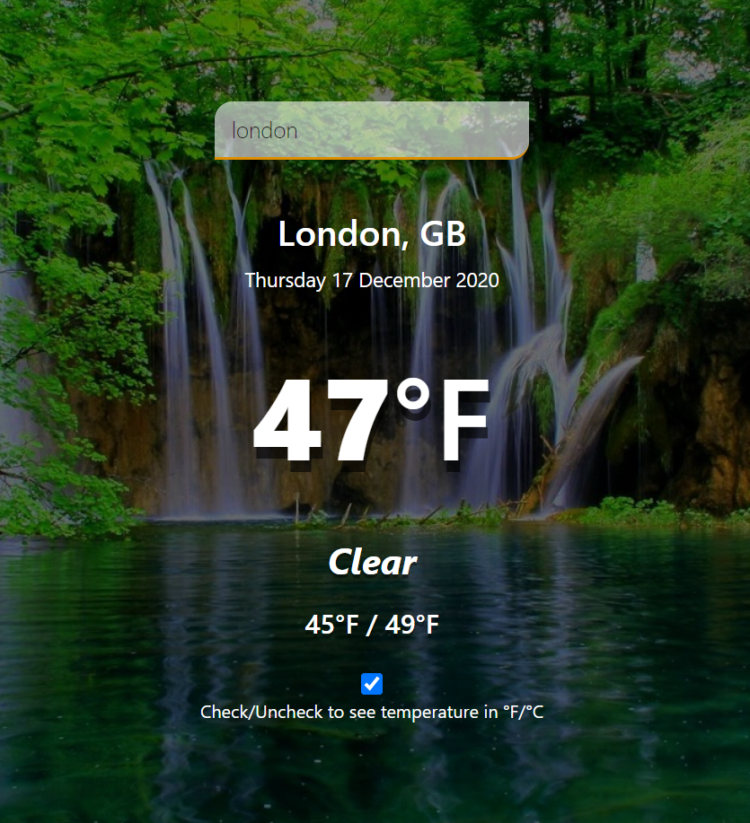

# WeatherApp

> The website was built with JavaScript, webpack and a weather API. This is a weather app that shows temperatures (current, min, max) by city name. The city name is obtained from form input. This app consumes OpenWeather API in the JSON format to show weather data.

## Landing page



## Live Link

[Live demo](https://weathernotif.netlify.app/)

## Technologies used:
- JavaScript programming language
- Bootstrap
- HTML & CSS
- Webpack
- .eslintrc (for validating js code).

## Setup the project on your machine:

To contribute to this project, run the following command on your terminal:
```
git clone https://github.com/Abhigyan001/WeatherApp/tree/feature
```

Once you have the cloned the project & you are still on the terminal, run:
```
cd WeatherApp
```

And run the app on your local machine in the browser of your choice.

## Author

👤 **Abhigyan Mahanta**

- Github: [@githubhandle](https://github.com/Abhigyan001)
- Linkedin: [Linkedin Profile](https://www.linkedin.com/in/abhigyanmahanta/)

## Show your support

Give a ⭐️ if you like this project!

## 📝 License

This project is a solo project of Microverse student. All rights are reserved for Abhigyan and Microverse.
